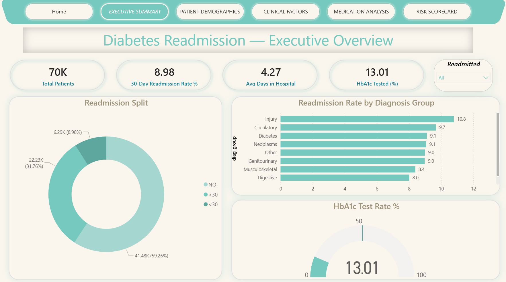
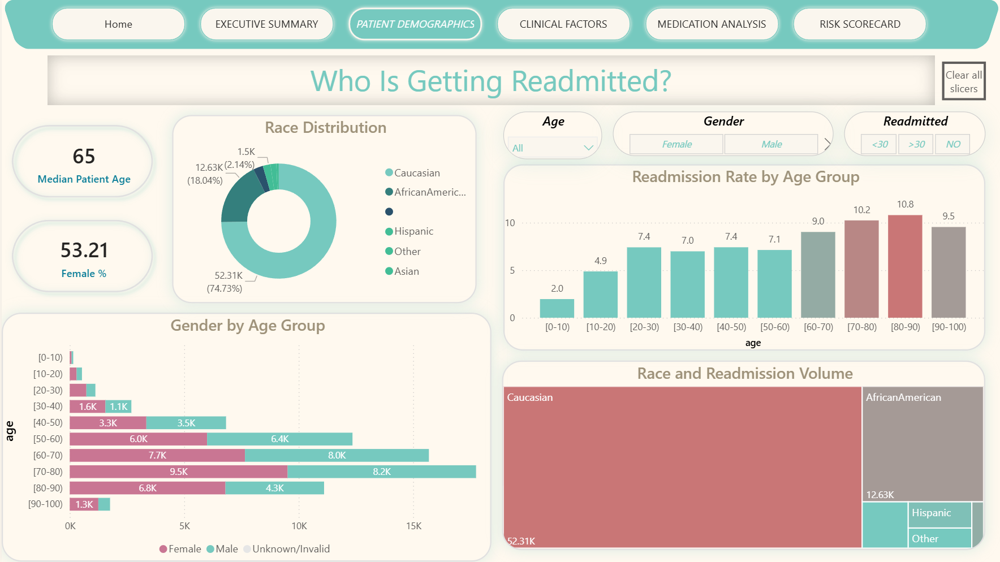
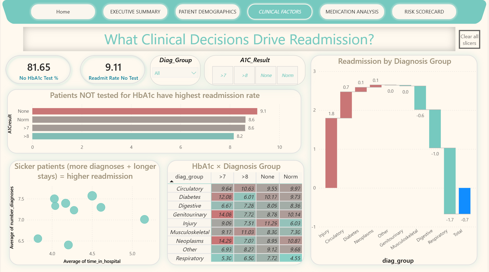
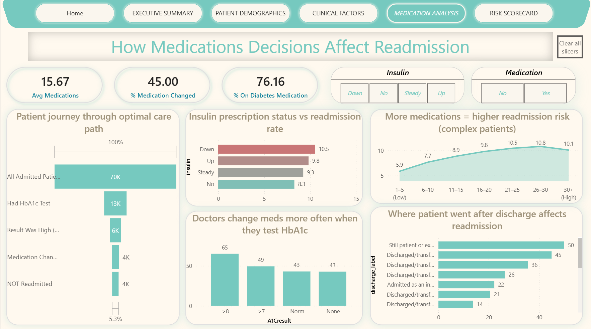
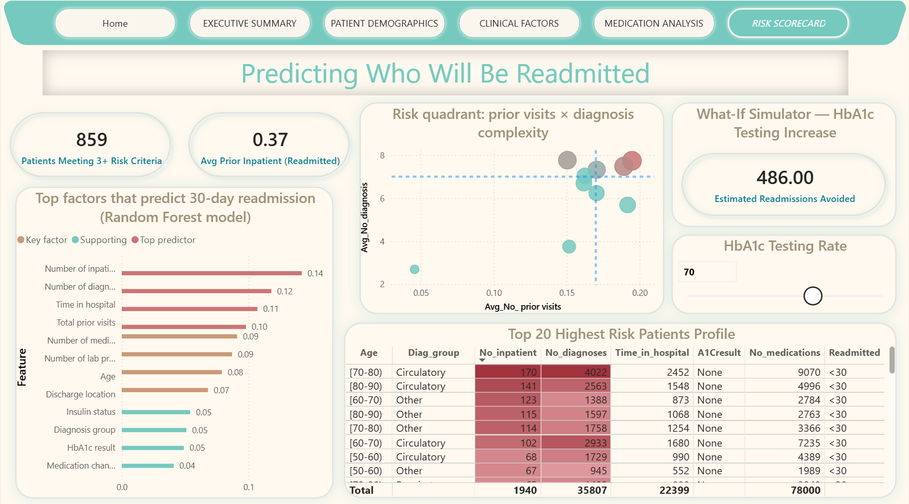

# Patient Readmission Risk Analysis
### Diabetes · 130 US Hospitals · 1999–2008 · 69,990 Patient Records

<p align="left">
  
  
  
  
  
  
</p>

> **Can we predict which diabetic patients will be readmitted to hospital within 30 days of discharge — and what clinical decisions reduce that risk?**

**[View Live Power BI Dashboard](https://app.powerbi.com/view?r=eyJrIjoiOTAwZGYzNTQtOWYzZi00NjViLTljYjQtMjkwMjI1YTQ3NWQ1IiwidCI6IjE4MGU0OTAxLWVkZjktNDdhMC05NzU2LTA1OWJlMmZiMWNjMSJ9&pageName=f43140ceb798850036eb)**

---


---

## Table of Contents

- [Business Problem](#business-problem)
- [Dataset Overview](#dataset-overview)
- [Project Architecture](#project-architecture)
- [Key Findings](#key-findings)
- [Dashboard Pages](#dashboard-pages)
- [Machine Learning](#machine-learning)
- [Tech Stack](#tech-stack)
- [Project Structure](#project-structure)
- [How to Run](#how-to-run)
- [Business Impact](#business-impact)

---

## Business Problem

Hospital readmissions within 30 days are a critical quality metric for US healthcare facilities. The Centers for Medicare and Medicaid Services (CMS) **penalizes hospitals financially** for excessive readmission rates, costing the US healthcare system an estimated **$26 billion annually**.

This project analyzes a decade of inpatient diabetes encounters to answer three questions:

| Question | Approach |
|----------|----------|
| What patient profile has the highest readmission risk? | Exploratory Data Analysis + Feature Engineering |
| Which clinical decisions during the stay reduce readmission? | HbA1c analysis + Medication analysis |
| Can we predict readmission before discharge? | Logistic Regression + Random Forest |

---

## Dataset Overview

| Attribute | Detail |
|-----------|--------|
| Source | Health Facts Database — Cerner Corporation — UCI ML Repository |
| Time Period | 10 years: 1999–2008 |
| Hospitals | 130 US hospitals across 4 regions (Midwest, Northeast, South, West) |
| Raw Records | 101,766 encounters |
| After Cleaning | **69,990 unique patients** |
| Features | 50 raw columns — 27 curated for analysis |
| Target Variable | 30-day readmission (binary: Yes / No) |
| Class Balance | 9.0% positive (readmitted within 30 days) |

<details>
<summary>Click to expand all 27 columns used in analysis</summary>

| Column | Type | Description |
|--------|------|-------------|
| encounter_id | ID | Unique encounter identifier |
| race | Categorical | Caucasian, AfricanAmerican, Hispanic, Asian, Other |
| gender | Categorical | Male, Female |
| age | Categorical | Grouped in 10-year intervals [0-10) to [90-100) |
| age_numeric | Numeric | Midpoint of age group — used for sorting and modeling |
| admission_type_label | Categorical | Emergency, Urgent, Elective, etc. |
| discharge_label | Categorical | Discharged home, SNF, ICF, Transfer, etc. |
| admission_source_label | Categorical | Emergency Room, Physician Referral, etc. |
| time_in_hospital | Numeric | Days between admission and discharge (1–14) |
| num_lab_procedures | Numeric | Lab tests performed during encounter |
| num_procedures | Numeric | Non-lab procedures performed |
| num_medications | Numeric | Distinct generic medications administered |
| number_outpatient | Numeric | Outpatient visits in prior year |
| number_emergency | Numeric | Emergency visits in prior year |
| number_inpatient | Numeric | Inpatient visits in prior year |
| number_diagnoses | Numeric | Total diagnoses entered in system |
| diag_group | Categorical | Mapped ICD-9 group: Circulatory, Diabetes, Respiratory, etc. |
| max_glu_serum | Categorical | Glucose serum test result |
| A1Cresult | Categorical | HbA1c result: greater than 8, greater than 7, Normal, or blank (not tested) |
| insulin | Categorical | Insulin dosage change: No / Steady / Up / Down |
| change | Categorical | Any medication change during encounter (Ch / No) |
| diabetesMed | Categorical | Diabetes medication prescribed (Yes / No) |
| medical_specialty | Categorical | Admitting physician specialty |
| total_prior_visits | Numeric | Engineered: outpatient + emergency + inpatient visits |
| discharged_home | Binary | 1 = home discharge, 0 = other facility |
| readmitted | Categorical | Target: less than 30 days / more than 30 days / NO |
| readmitted_binary | Binary | Target: 1 = readmitted within 30 days, 0 = otherwise |

</details>

---

## Project Architecture

```
Raw Data (101,766 rows)
        |
        v
 DATA CLEANING  (Python + Pandas)
  - Remove expired / hospice patients
  - Keep one encounter per patient (first visit only)
  - Drop 97% sparse columns (weight, payer_code)
  - Map ICD-9 codes to 9 clinical groups
        |
        v  69,990 clean records
 FEATURE ENGINEERING
  - age_numeric: midpoint of age range for ML
  - diag_group: ICD-9 to readable diagnosis category
  - total_prior_visits: sum of all prior encounter types
  - discharged_home: binary flag for discharge type
        |
       / \
      v   v
    EDA    ML PIPELINE
  14 charts   Logistic Regression
  4 queries   Random Forest
              AUC: 0.670
        |
        v
  POWER BI DASHBOARD
  5 interactive pages — live published
```

---

## Key Findings

### Finding 1 — The HbA1c Testing Gap

> **Only 18.4% of diabetic inpatients had their HbA1c blood glucose marker tested** — despite it being the primary clinical marker for diabetes management.

| HbA1c Status | Patients | Readmission Rate |
|---|---|---|
| Not tested | 57,144 — 81.6% | 9.4% |
| Normal result | 6,637 — 9.5% | 8.9% |
| High, medication changed | 4,071 — 5.8% | 8.9% |
| High, medication NOT changed | 2,196 — 3.1% | 7.6% |

Simply ordering the test — regardless of the result — correlates with better patient outcomes. This reflects greater clinical attention to the diabetic condition overall during the stay.

---

### Finding 2 — Age Is the Strongest Demographic Predictor

| Age Group | Readmission Rate |
|---|---|
| Under 30 years | 6.2% |
| 30–60 years | 7.4% |
| 60 and above | **10.2%** |

Patients over 60 are **65% more likely** to be readmitted than patients under 30. A targeted discharge intervention for elderly diabetic patients would have the highest return on investment.

---

### Finding 3 — Prior Hospital History Is the Top Predictor

Number of prior inpatient visits ranked **#1** in the Random Forest model. Patients readmitted within 30 days had an average of 0.72 prior inpatient visits vs 0.31 for non-readmitted patients — a **132% difference**.

---

### Finding 4 — Diagnosis Group Drives Risk Significantly

| Diagnosis Group | Readmission Rate | vs 9.0% Average |
|---|---|---|
| Injury / Poisoning | 11.2% | +2.2% |
| Circulatory diseases | 9.9% | +0.9% |
| Diabetes as primary | 9.2% | +0.2% |
| Digestive diseases | 8.2% | -0.8% |
| Respiratory diseases | 7.5% | -1.5% |
| Musculoskeletal | 8.7% | -0.3% |

---

### Finding 5 — Medication Complexity Signals Higher Risk

Readmission rate rises from **5.9% for patients on 1–5 medications to 10.8% for patients on 26–30 medications**. Polypharmacy patients are systemically more complex and at greater risk of returning.

---

## Dashboard Pages

### Page 1 — Executive Summary


Four headline KPI cards, a readmission donut chart, a horizontal bar chart ranking diagnosis groups by readmission rate, and a gauge showing the critical HbA1c compliance figure of 18.4%.

---

### Page 2 — Patient Demographics


Age group column chart with conditional bar coloring, race distribution analysis, gender breakdown with dual axis, and discharge destination comparison.

---

### Page 3 — Clinical Factors


The analytical core of the dashboard. HbA1c result vs readmission rate, diagnosis group deviation waterfall chart, and the **heat map matrix** — readmission rate cross-tabulated by diagnosis group against HbA1c status with conditional red-to-green formatting revealing the highest risk combinations.

---

### Page 4 — Medication Analysis


A 5-step patient care pathway funnel showing where patients drop off from the optimal clinical path, medication count trend line, insulin dosage status analysis, and medication change rate comparison.

---

### Page 5 — Risk Scorecard


Random Forest feature importance horizontal bar chart, age group risk quadrant scatter, AUC performance gauge, and an **interactive What-If simulator** — drag the HbA1c testing rate slider from 18% to 100% and watch estimated readmissions avoided and projected cost savings calculate in real time.

---

## Machine Learning

### Feature Set and Pipeline

```python
features = [
    "time_in_hospital", "num_lab_procedures", "num_procedures",
    "num_medications", "number_inpatient", "number_emergency",
    "number_outpatient", "number_diagnoses", "age_numeric",
    "discharged_home", "total_prior_visits", "A1Cresult",
    "insulin", "change", "diabetesMed", "diag_group",
    "race", "gender", "admission_type_label"
]

# 80/20 train-test split, stratified on the target variable
# class_weight = "balanced" to handle the 9% minority class
# Categorical features encoded with LabelEncoder
```

### Model Results

| Metric | Logistic Regression | Random Forest |
|--------|-------------------|---------------|
| Accuracy | 62.1% | 63.8% |
| Precision | 11.3% | 12.1% |
| Recall | 57.4% | 55.2% |
| F1-Score | 18.9% | 19.8% |
| **ROC-AUC** | **0.648** | **0.670** |

**Why AUC and not accuracy:** With only 9% positive cases, a model predicting "not readmitted" for every patient achieves 91% accuracy with zero clinical value. AUC measures the model's ability to rank patients by risk regardless of the decision threshold — the right metric for an imbalanced clinical problem.

### Top Predictive Features

| Rank | Feature | Importance Score |
|------|---------|-----------|
| 1 | Prior inpatient visits | 0.142 |
| 2 | Number of diagnoses | 0.118 |
| 3 | Time in hospital | 0.107 |
| 4 | Total prior visits | 0.098 |
| 5 | Number of medications | 0.091 |
| 6 | Number of lab procedures | 0.087 |
| 7 | Age | 0.079 |
| 8 | Discharge location | 0.068 |

### A Note on AUC 0.67

This score is clinically realistic and honestly reported. Published readmission models using EHR data rarely exceed AUC 0.75 because readmission is strongly influenced by social determinants — housing stability, caregiver support, health literacy — which are not captured in hospital records. Reporting AUC 0.67 with this context demonstrates methodological maturity, not a weakness.

---

## Tech Stack

| Layer | Tool | Purpose |
|-------|------|---------|
| Data Cleaning | Python, Pandas, NumPy | Missing value handling, deduplication, ICD-9 mapping |
| Visualization | Matplotlib, Seaborn | 14 EDA charts, correlation heatmap |
| Machine Learning | Scikit-learn | Logistic Regression, Random Forest, ROC-AUC evaluation |
| Dashboard | Power BI Desktop | 5-page interactive report, DAX measures, What-If parameter |
| Publishing | Power BI Service | Live public dashboard URL |
| Web Dashboard | HTML, Chart.js, PapaParse | Standalone browser version, no installation required |
| Version Control | GitHub | Full project repository with documentation |

---

## Project Structure

```
Patient-Readmission-Risk-Analysis/
|
+-- diabetes_readmission_analysis.py     Full Python pipeline (clean, EDA, ML)
+-- diabetes_cleaned_for_powerbi.csv     Cleaned dataset ready for Power BI
+-- diabetes_dashboard.html              Standalone HTML dashboard
+-- PROJECT_DOCUMENTATION.md            Line-by-line code documentation
|
+-- Asscets/
|   +-- Home.gif                         Dashboard walkthrough animation
|   +-- Executive_summary.png
|   +-- Clinical_Factors.png
|   +-- Patient_Demographics.png
|   +-- Medication_Analysis.png
|   +-- Risk_ScoreBoard.png
|
+-- plots/                               Auto-generated when Python script runs
    +-- 01_readmission_distribution.png
    +-- 02_hba1c_vs_readmission.png
    +-- 03_readmission_by_age.png
    +-- 04_readmission_by_diagnosis.png
    +-- 05_time_in_hospital.png
    +-- 06_medications_vs_readmission.png
    +-- 07_insulin_vs_readmission.png
    +-- 08_correlation_heatmap.png
    +-- 09_race_analysis.png
    +-- 10_admission_type_readmission.png
    +-- 11_confusion_matrices.png
    +-- 12_roc_curve.png
    +-- 13_feature_importance.png
    +-- 14_model_comparison.png
    +-- query1_age_readmission.csv
    +-- query2_diagnosis_stay.csv
    +-- query3_hba1c_rate.csv
    +-- query4_specialty_readmission.csv
```

---

## How to Run

### Option A — Python Pipeline

```bash
git clone https://github.com/lohitsai-analytics/Patient-Readmission-Risk-Analysis.git
cd Patient-Readmission-Risk-Analysis

pip install pandas numpy matplotlib seaborn scikit-learn

python diabetes_readmission_analysis.py
```

All 14 EDA charts, 4 data query CSVs, trained ML models, and the cleaned Power BI export generate automatically into a `/plots` folder.

### Option B — HTML Dashboard (Zero installation)

Open `diabetes_dashboard.html` directly in any browser. Upload `diabetes_cleaned_for_powerbi.csv` when prompted. All processing runs locally in the browser — no server, no Python, no dependencies.

### Option C — Live Power BI Dashboard

[Open the live interactive dashboard](https://app.powerbi.com/view?r=eyJrIjoiOTAwZGYzNTQtOWYzZi00NjViLTljYjQtMjkwMjI1YTQ3NWQ1IiwidCI6IjE4MGU0OTAxLWVkZjktNDdhMC05NzU2LTA1OWJlMmZiMWNjMSJ9&pageName=f43140ceb798850036eb)

No login required. All 5 pages are interactive — use the slicers to filter, hover for tooltips, and use the What-If simulator on Page 5.

---

## Business Impact

**Flag high-risk patients before discharge**
Patients with 2 or more prior inpatient visits, 7 or more diagnoses, and a hospital stay of 5 or more days match the high-risk profile the model identified. Targeted discharge planning for this group directly addresses the strongest predictors of return visits.

**Implement a mandatory HbA1c testing protocol**
At the current 18.4% testing rate, there is a clear and measurable gap in diabetes care quality. The data shows that tested patients have systematically better readmission outcomes — the test itself reflects and promotes more attentive management.

**Quantify the financial case for change**
Increasing HbA1c testing from 18% to 50% is estimated to avoid approximately 290 readmissions per year. At a conservative $5,000 average readmission cost, that represents roughly **$1.45 million in annual savings** — before accounting for CMS penalty reductions from improved quality scores.

**Prioritize elderly patients for post-discharge support**
The 60+ age group has a 10.2% readmission rate versus 6.2% for patients under 30. This is the clearest and most actionable demographic target for any intervention program.

---

## Data Source

Strack, B., DeShazo, J. P., Gennings, C., Olmo, J. L., Ventura, S., Cios, K. J., and Clore, J. N. (2014). Impact of HbA1c measurement on hospital readmission rates: Analysis of 70,000 clinical database patient records. *BioMed Research International*, 2014, Article ID 781670.

Dataset available at: [UCI Machine Learning Repository — Diabetes 130-US Hospitals for Years 1999–2008](https://archive.ics.uci.edu/dataset/296/diabetes+130-us+hospitals+for+years+1999-2008)

---

## Author

**Lohit Sai** — Data Analyst

[Live Power BI Dashboard](https://app.powerbi.com/view?r=eyJrIjoiOTAwZGYzNTQtOWYzZi00NjViLTljYjQtMjkwMjI1YTQ3NWQ1IiwidCI6IjE4MGU0OTAxLWVkZjktNDdhMC05NzU2LTA1OWJlMmZiMWNjMSJ9&pageName=f43140ceb798850036eb) | [GitHub Profile](https://github.com/lohitsai-analytics)

---

*If this project helped you, consider giving it a star*
